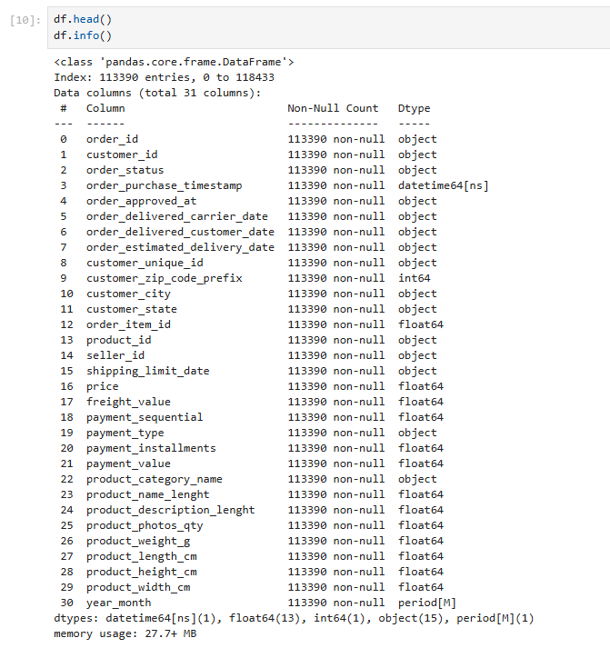
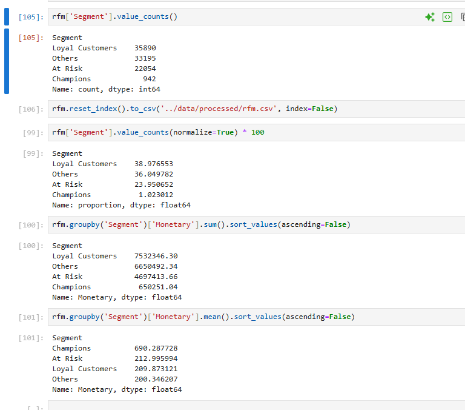
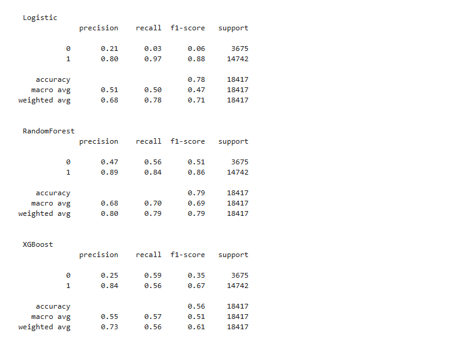

# 🚀 Customer Intelligence System (E2E Data Analytics + ML Project)

## 📊 Overview
This project is an end-to-end **Customer Intelligence System** that analyzes customer behavior, identifies key business insights, and predicts customer churn using machine learning.

It combines **SQL, Python, Machine Learning, and Power BI** to build a complete data-driven decision system.

---

## 🔥 Key Features

- 📊 Exploratory Data Analysis (EDA) on 100K+ transactions  
- 🧠 RFM-based Customer Segmentation  
- 📉 Churn Prediction using ML models  
- 🗄️ SQL-based business insights  
- 📈 Interactive Power BI Dashboard  

---

## 🧩 Dataset

- Brazilian E-commerce Dataset (Olist)
- ~100,000+ orders
- Customers, payments, products, reviews

---

## ⚙️ Tech Stack

- **Python** (Pandas, NumPy, Scikit-learn)
- **SQL** (SQLite)
- **Machine Learning** (Logistic Regression, Random Forest, XGBoost)
- **Power BI**
- **Git & GitHub**

---

## 📊 Exploratory Data Analysis

Performed data cleaning, feature engineering, and exploratory analysis.

---

## 👥 Customer Segmentation (RFM)

Segmented customers based on:

- Recency  
- Frequency  
- Monetary Value  

### Key Segments:
- Champions  
- Loyal Customers  
- At Risk  
- Others  

---

## 🤖 Churn Prediction Model

Built ML models to predict churn:

- Logistic Regression  
- Random Forest  
- XGBoost  

### 📈 Best Model: Random Forest

- Accuracy: ~79%  
- Balanced precision & recall  

---

## 🗄️ SQL Analysis

Extracted business insights using SQL:

- Total Revenue  
- Monthly Trends  
- Top Categories  
- Region-wise Sales  
- Repeat Customer Rate  

---

## 📈 Power BI Dashboard

Interactive dashboard for business monitoring:

- Revenue trends  
- Customer segments  
- Top products  
- Region analysis  

---
## 📂 Project Structure
customer-intelligence-system/
│
├── assets/ # Screenshots & visuals
├── dashboard/ # Power BI file
├── data/ # Dataset (raw & processed)
├── model/ # ML notebook
├── notebooks/ # EDA notebook
├── sql/ # SQL queries
├── README.md
├── .gitignore

---

## 💡 Key Insights

- Top 20% customers contribute ~60% of revenue  
- High number of one-time buyers → churn risk  
- Certain regions drive majority of sales  
- Customer segmentation enables targeted retention strategies  

---

## 🚀 Future Improvements

- Deploy model as API  
- Real-time dashboard integration  
- Advanced feature engineering  
- Hyperparameter tuning  

---
